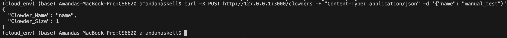
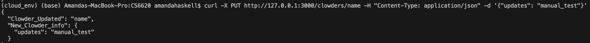
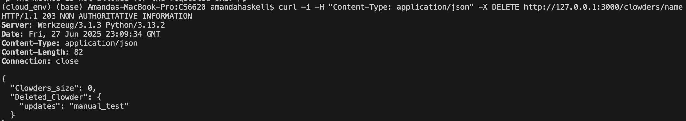

# CI/CD pipeline (part 3) - Orchestration and CRUD

### Add functionality to create, read, update, and destroy items in a DynamoDB table and an S3 bucket. 

### Use Localstack to run a mock of AWS as part of your application stack. 

### Create two compose files and corresponding shell scripts: one will run the stack until manually stopped, 

### the other will run the tests and exit with a zero status if the tests pass and a non-zero status if the tests fail. 

### Put all relevant files into a repository, and enable automatic and manual runs of the tests using a workflow. 

### Include a README along with instructions for running the stack and tests

- Sending a GET request with appropriate parameters returns expected JSON from the database
- Sending a GET request that finds no results returns the appropriate response
- Sending a GET request with no parameters returns the appropriate response
- Sending a GET request with incorrect parameters returns the appropriate response
- Sending a POST request results in the JSON body being stored as an item in the database, and an object in an S3 bucket
- Sending a duplicate POST request returns the appropriate response
- Sending a PUT request that targets an existing resource results in updates to the appropriate item in the database and object in the S3 bucket
- Sending a PUT request with no valid target returns the appropriate response
- Sending a DELETE request results in the appropriate item being removed from the database and object being removed from the S3 bucket
- Sending a DELETE request with no valid target returns the appropriate response

For each test, the database item and S3 object should match.

### References:
- https://docs.aws.amazon.com/amazondynamodb/latest/developerguide/DynamoDBLocal.DownloadingAndRunning.html

# CI/CD pipeline part 2

### Create a REST API with endpoints for GET, POST, PUT, and DELETE verbs, and tests for each endpoint. The endpoints should return appropriate status codes (e.g. 200 on successful GET), and tests should assert this behavior. Consider using test-driven development to write the software. 

[Source Code for Flask Application](src/cat_pkg/assign_2.py)

[Test Code for Flask Application](tests/test_assign_2.py)

### Create two Dockerfiles and corresponding shell scripts: 
#### one will run the REST API until manually stopped:

[Dockerfile for REST API Run](src/Dockerfile)

[Shell script to Build and Run Container for REST API Run](src/cont_run_app.sh)

#### the other will run the tests and exit with a zero status if the tests pass and a non-zero status if the tests fail:

[Docker file for API Tests](tests/Dockerfile)

[Shell Script to Build and Run Container for AP Tests](tests/cont_test_api.sh)

### Put the code, Dockerfiles, and shell scripts into a repository, and enable automatic and manual runs of the tests using a workflow. 

[Github Automatic Workflow for Testing](.github/workflows/assign_1_ci.yml)

#### 14 total tests should run:

#### Tests can be run manually via Github Actions.

#### Click the "Run workflow" button shown below and "Run workflow" again in the menu that appears.

#### REST API within Docker container can be manually run by enabling execution of shell script cont_run_app.sh:

chmod +x src/cont_run_app.sh

#### and running that shell script from the commandline:

./src/cont_run_app.sh

*The exposed port for the API is 3000.*

Running a base GET for the App involves using curl or opening : http://127.0.0.1:3000/clowders

*Note: you must add "/clowders" for basic GET*

Terminal or website should display (if no previous POST or PUT commands were run):

{
  
"Clowders": []

}

To test POST action run the curl command below and receive back the Clowder Name and Clowder size information

To test PUT (in this case updating the dictionary associated with the previous POST clowder) run the curl command below and receive back the name of clowder which was updated ("Clowder_Updated") and the new information that was added ("New_Clowder_Info")

To test DELETE run the curl command below and receive back the number of clowders remaining, and the clowder information removed (data, not name)

## References: 
https://medium.com/@AlexanderObregon/how-to-build-a-simple-rest-api-with-flask-in-python-9adcd56cf3da

https://flask.palletsprojects.com/en/stable/testing/

https://www.geeksforgeeks.org/python/flask-creating-rest-apis/

# CI/CD pipeline part 1

When working on a software team, different programmers need to add features and fixes to the same code base without breaking anything. Typically the team maintains guarantees around consistency and quality in the form of automated testing. When a contributor adds or changes code to a branch in a repository, tests run and give feedback. This indicates that behavior under test did not change--at least, not in a way that caused test failures. Github commonly hosts software and offers a straightforward approach to creating automation pipelines, which they call "workflows".

 

### Create a repository containing some code:
 https://github.com/ahaskell83/CS6620.git

### Relevant tests for that code:
[Testing for Cat and Clowder Classes](tests/test_cat_code.py)

### Dependency management file(s):

[requirements.txt](requirements.txt)
 
Note: When creating this file must omit local paths so need to use: 

pip list --format=freeze >requirements.txt

### Workflow that runs whenever a user changes either:
[Github Workflow Code](.github/workflows/assign_1_ci.yml)

### To run workflow ad hoc:

Tests can be run manually via Github Actions.
Click the "Run workflow" button shown below and "Run workflow" again in the menu that appears.

### Instructions for running the code and scripts:

All tests will run automatically on any push to the main branch of the repo.

Tests can be run out of repo from the files themselves using the command line with the command:

pytest -v

All project code is located in the "cat_code.py" file and consists of two classes: Cat and Clowder.

A Clowder is a community structure of Cats. You can have an empty Clowder as all cats may be adopted (yay!). The more Cats that live in a clowder, the more likely that the cats will breed. A Cat gestation period is 65 days and all intact females at least one year old can and will have kittens. The number of kittens ranges from 1-9 per intact mom. Cats are identified with a name, date of birth, gender, whether or not they have been neutered or spayed, and their arrival date in the clowder (often the day they are born).

All testing code is located in the "test_cat_code.py" file.

## References:

[Github Docs: Workflows](https://docs.github.com/en/actions/writing-workflows)

https://github.com/devopselvis/github-actions-presentation/tree/main
